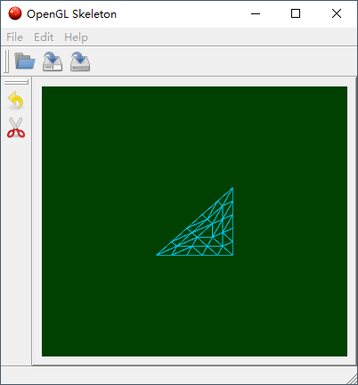
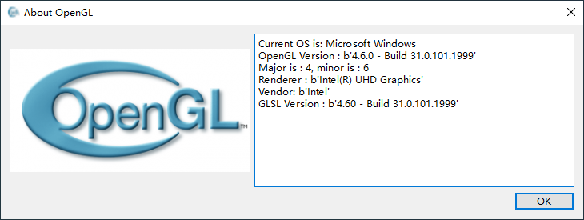

# GL Skeleton
GL Skeleton is an OpenGL application template based on PySide6 and PyOpenG.

## Screenshot


## Requirements
* PySide6
* PyOpenGL
* numpy

## Change Log

### `2022-08-08`

Change images, all of images come from [iconfinder](https://www.iconfinder.com/).

Modify the code to use modern OpenGL, now it's using OpenGL 4.0 by default.

You're able to change the OpenGL version in baseapp.py:
```python
class BaseApplication(QApplication):
	def __init__(self, argv, bufferSize=24, samples=4, major=4, minor=0):
		super().__init__(argv)
		# initialize OpenGL profile, support OpenGL 4.0 by default
		self.format = QSurfaceFormat()
		self.format.setDepthBufferSize(bufferSize)
		self.format.setSamples(samples)
		self.format.setVersion(major, minor)
		self.format.setProfile(QSurfaceFormat.CoreProfile)
		QSurfaceFormat.setDefaultFormat(self.format)
```

Add About Dialog to show OpenGL information




### `2021-01-03`

Upload the code at first time.


## Run
Tested on Python 3.8.6, Python 3.9.7 and Windows 10 OS

`python main.py`


