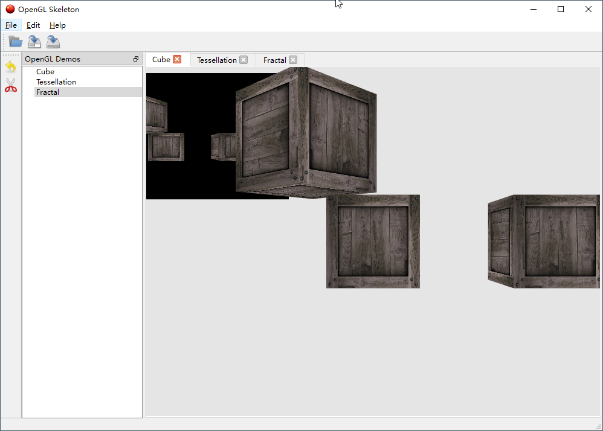
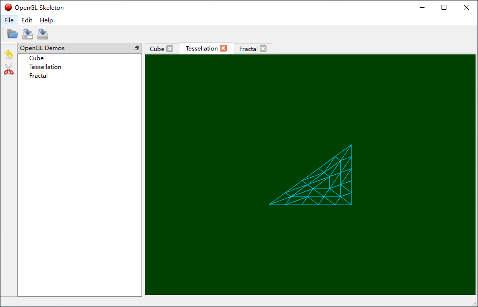
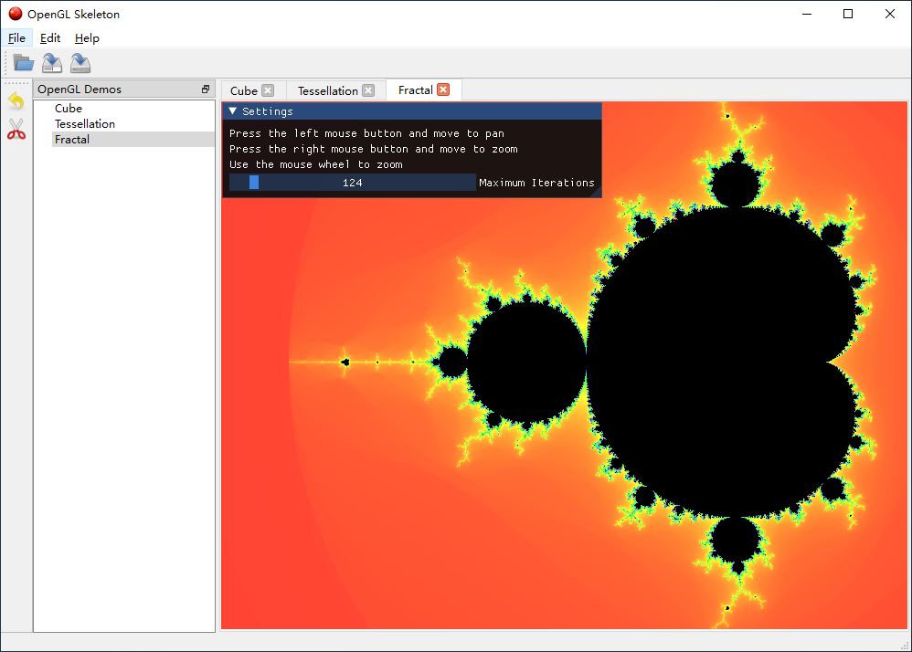

# GL Skeleton

[](https://github.com/EagleEatApple/glskeleton/actions/workflows/ci.yml)

GL Skeleton is a 3D OpenGL application template based on PySide6 and PyOpenGL.
GL Skeleton requires at least python 3.9 and OpenGL 4.6, and runs on Windows and Linux.

If you enjoy the repository, please give my repo a star ⭐ ⬆️. 

## Screenshot




## Requirements
* Python >= 3.9
* OpenGL 4.6
* Runtime dependencies (managed by [uv](https://github.com/astral-sh/uv), see `pyproject.toml`):
  * PySide6
  * PyOpenGL
  * numpy
  * PyGLM
  * Pillow
  * imgui

## Current Features: :gear:  

- [x] Refactory py3gl4 to only support OpenGL 4.6, and includes major OpenGL objects
```python
class Program:
class VertexShader(Shader):
class TessellationControlShader(Shader):
class TessellationEvaluationShader(Shader):
class GeometryShader(Shader):
class FragmentShader(Shader):
class ComputeShader(Shader):
class VertexArrayObject:
class VertexBufferObject:
class ElementBufferObject:
class Texture2D(Texture):
class Framebuffer:
class Renderbuffer:
```
- [x] Demo cube demonstrates the usage of framebuffer and renderbuffer
- [x] Demo fractal demonstrates the usage of compute shader
  - [x] Mouse control
  - [x] Integrate with imgui
- [x] Demo tessellation demonstrates the usage of all 5 shaders (VertexShader, TessellationControlShader, TessellationEvaluationShader, GeometryShader and FragmentShader)
  - [x] Integrate with imgui

## Run
Tested on Python 3.9.7, 3.10.6 and Windows 10 OS. This project uses [`uv`](https://github.com/astral-sh/uv) for dependency management.

### Command line (recommended, works everywhere)
Clone the repository, then
```bash
cd glskeleton
uv sync
uv run python -m glskeleton
```
Alternatively, use the entry point defined in `pyproject.toml`:
```bash
uv run glskeleton
```

### VS Code
A `.vscode/launch.json` is included for VS Code users:
1. Open the project root in VS Code.
2. `Ctrl+Shift+P` → "Python: Select Interpreter" → choose `.venv/Scripts/python.exe` (Windows) or `.venv/bin/python` (Linux/macOS).
3. Press `F5`, or open the "Run and Debug" panel and click the green triangle next to the "glskeleton (module)" configuration.

> **Note**: Do not use the ▶ button in the top-right corner to run `glskeleton/app.py`. That button executes `python glskeleton/app.py` directly and bypasses the debug configuration, which causes relative imports to fail with `attempted relative import with no known parent package`. If you prefer the ▶ button, open `run.py` in the project root instead.

### Other IDEs
For PyCharm, Spyder, etc., configure the run target to execute the **module** `glskeleton` (equivalent to `python -m glskeleton`) rather than the file `glskeleton/app.py`. See the respective IDE's documentation for details.

The command line form always works regardless of IDE:
```bash
uv run python -m glskeleton
```
