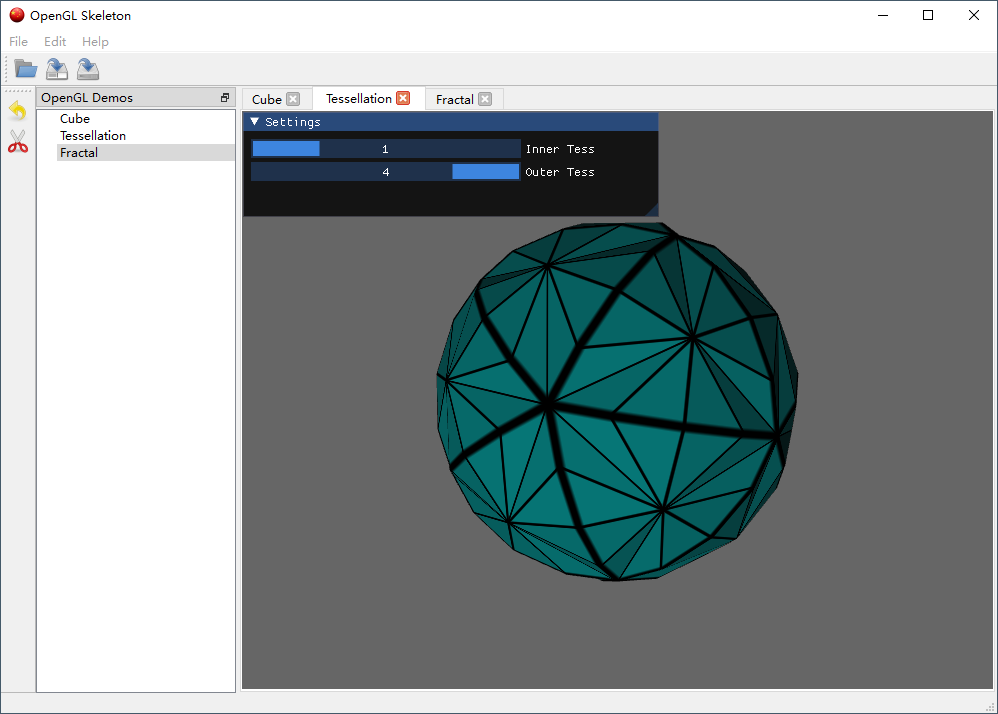

# GL Skeleton
GL Skeleton is a 3D OpenGL application template based on PySide6 and PyOpenGL.
GL Skeleton requires at least python 3.9 and OpenGL 4.6, and runs on Windows and Linux.

## Screenshot




## Requirements
* PySide6
* PyOpenGL
* numpy
* PyGLM
* Pillow
* imgui


## Current Features: :gear:  

- [x] Refactory py3gl4 to only support OpenGL 4.6, and includes major OpenGL objects
```python
class Program:
class class VertexShader(Shader):
class TessellationControlShader(Shader):
class TessellationEvaluationShader(Shader):
class GeometryShader(Shader):
class FragmentShader(Shader):
class ComputeShader(Shader):
class VertexArrayObject:
class VertexBufferObject:
class ElementBufferObject:
class Texture2D(Texture):
class Framebuffer:
class Renderbuffer:
```
- [x] Demo cube demonstrates the usage of framebuffer and renderbuffer
- [x] Demo fractal demonstrates the usage of compute shader
  - [x] Mouse control
  - [x] Integrate with imgui
- [x] Demo tessellation demonstates the usage of all 5 shaders (VertexShader, TessellationControlShader, TessellationEvaluationShader, GeometryShader and FragmentShader
  - [x] Integrate with imgui

## Run
Tested on Python 3.9.7, 3.10.6 and Windows 10 OS
Clone the repository, and then
cd glskeleton
python app.py
